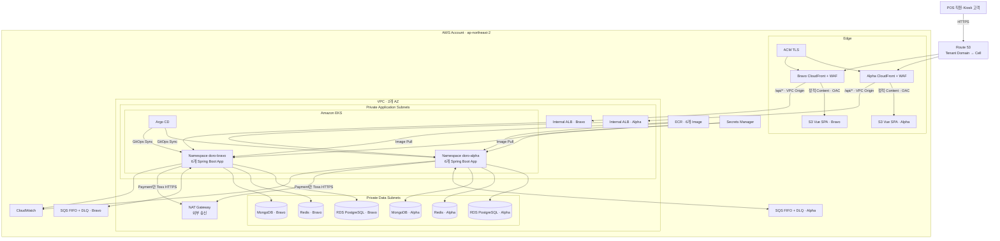
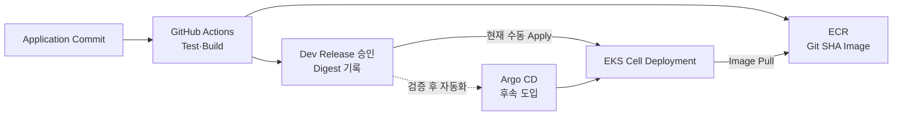

# AWS EKS 셀 기반 인프라 설계

> 프로젝트: SaaS 기반 POS·Kiosk 주문·결제 및 대기열 관리 서비스
>
> 문서 상태: 목표 아키텍처 및 구현 기준선
>
> 기준일: 2026-08-10
>
> 현재 구현 상태: Dev Alpha AWS Foundation Terraform이 구현·적용되었고 ElastiCache Redis·MongoDB Atlas 전용 Stack, 여섯 Application의 Kustomize Base·Secrets Manager 연결, AWS Load Balancer Controller 권한·설치 값과 Edge 단일 Public Ingress가 구현되었다. GitHub OIDC 기반 ECR Push Role과 Service Image 게시 Workflow도 정의되었다. ALB HTTPS Listener·Regional ACM 인증서·NetworkPolicy·가용성 Manifest와 CloudWatch 중앙 Log·최소 Alarm은 코드에 반영되었으며 실제 AWS 검증이 남아 있다. Dev 배포는 승인된 ECR Digest를 Git에 기록한 뒤 수동 적용하고, 자동 CD와 Argo CD는 이 절차를 검증한 후 도입한다.

## 1. 문서의 목적

이 문서는 지금까지 논의한 Doro SaaS POS·Kiosk의 AWS 인프라 방향을 한 곳에서 설명한다. 단순한 AWS 서비스 목록이 아니라 다음 질문에 답하는 것을 목표로 한다.

- 여러 업체가 같은 SaaS를 사용할 때 Tenant를 어디에서 구분하는가?
- 공유 Pool과 전용 Cell을 한 EKS Cluster에서 어떻게 함께 운영하는가?
- 팀원이 각 Spring Boot Module의 배포 Manifest를 독립적으로 관리하면서 하나의 ALB를 공유할 수 있는가?
- 서비스별 Database와 SQS Queue는 어느 범위에서 분리하는가?
- Namespace가 다르면 정말 통신이 차단되는가?
- GitHub Actions, ECR, Argo CD와 Kustomize는 각각 무엇을 담당하는가?
- 현재 확정된 사항과 아직 선택이 필요한 사항은 무엇인가?

제품 기능과 Application 내부 계약은 이 문서가 다시 정의하지 않는다. 관련 정본은 다음 문서다.

- [제품·시스템 개요](../../Docs/Doro_SaaS_POS_Kiosk.md)
- [공통 서비스 통신 계약](../../Docs/Specifications/공통_서비스_통신_계약.md)
- [비동기 Event 계약](../../Docs/Specifications/비동기_Event_계약.md)
- [서비스별 계약 카탈로그](../../Docs/Specifications/서비스별_계약_카탈로그.md)
- [기술 스택](<../../Docs/의사결정/ERP 기술 스택.md>)

AWS 배포 Topology·Cell 격리·IngressGroup·자원 소유권은 이 문서를 기준으로 한다. [Infra README](../README.md)는 현재 구현 상태와 실행·검증 진입점을 소유한다. 설계가 변경되면 두 문서를 같은 변경에서 맞춘다.

## 2. 결론부터 보는 설계 요약

현재 목표는 **AWS의 한 EKS Cluster에서 Cell 단위로 워크로드를 나누고, Cell 내부에는 다섯 업무 Application과 Stateless Edge Runtime을 독립 배포하는 구조**다.

```text
Tenant Domain
→ Route 53
→ Cell별 CloudFront + WAF
→ Cell별 내부 ALB
→ `/api/v1`을 소유한 Edge 단일 Ingress
→ Edge 내부 HMAC Routing
→ Store Access / Commerce / Payment / Queue / Audit ClusterIP
→ Cell 전용 데이터·SQS·Secret
```

핵심 결정은 다음과 같다.

| 구분 | 현재 기준 |
|---|---|
| Cloud | AWS, 기본 Region `ap-northeast-2` |
| Container Runtime | Amazon EKS 관리형 Node Group |
| 배포 방식 | GitHub Actions + ECR + Argo CD GitOps |
| Manifest | 서비스별 Kustomize Base, 환경·Cell Overlay |
| 외부 진입 | Route 53, ACM, CloudFront, WAF, Cell별 ALB |
| API Routing | Cell별 Edge 단일 Ingress가 `/api/v1`을 소유하고 Module은 ClusterIP만 소유 |
| Frontend | Vue SPA를 S3에 배포하고 CloudFront OAC로만 접근 |
| 관계형 데이터 | Amazon RDS for PostgreSQL, 서비스별 Database와 Role |
| Session | Dev Alpha는 ElastiCache for Redis OSS 7.1 단일 Node, TLS·RBAC |
| Audit | Dev Alpha 발표 환경은 MongoDB Atlas 8.0 M0 Free, NAT 고정 IP `/32` 허용 |
| Messaging | Cell별 SQS FIFO Main Queue 3개와 FIFO DLQ 3개 |
| Secret | AWS Secrets Manager, EKS Pod Identity 기반 최소 권한 |
| 관측성 | CloudWatch Log·Metric·Alarm + Application Actuator·Micrometer |
| Tenant 기본 모델 | Cell 내부는 공유 Pool과 `tenant_id` 논리 격리 |
| 전용 Tenant | 별도 Cell에 Application·데이터·Queue·Secret을 분리 |

이 구조에서 **Namespace는 Tenant 경계가 아니라 Cell 경계**다. Alpha Cell의 Tenant A와 B를 각각 Namespace로 나누지 않는다. 두 Tenant는 동일한 Application과 Database를 공유하고 Application의 검증된 `tenant_id`로 구분한다.

## 3. Pool Model과 Cell Model의 관계

### 3.1 Alpha Cell: 공유 Pool

Alpha Cell은 여러 일반 Tenant가 함께 사용하는 기본 SaaS 실행 환경이다.

```text
Alpha Cell
├─ Tenant A: a.doro.com
├─ Tenant B: b.doro.com
├─ Store Access Pods
├─ Commerce Pods
├─ Payment Pods
├─ Queue Pods
├─ Audit Pods
├─ Cell 전용 PostgreSQL 4 DB
├─ Cell 전용 Redis·MongoDB
└─ Cell 전용 SQS Queue·DLQ
```

Tenant A와 B는 다음 자원을 공유한다.

- 같은 여섯 Application Deployment와 Service
- 같은 Cell ALB와 IngressGroup
- 같은 PostgreSQL Instance 또는 Cluster
- 같은 Cell의 서비스별 Database
- 같은 Redis와 MongoDB 운영 단위
- 같은 Cell의 SQS Queue

공유 자원 안에서의 최종 격리는 다음 계층이 함께 보장한다.

1. Store Access가 검증한 Session 또는 Kiosk Credential
2. Application의 `VerifiedActorContext`
3. 모든 Use Case와 Repository Query의 `tenant_id`·`store_id` 조건
4. Tenant Scope가 포함된 Unique Constraint, Cache Key와 Event
5. 다른 Tenant Resource의 존재를 숨기는 `404` 응답 계약

Domain이나 Host 이름만 보고 Tenant 권한을 부여하지 않는다. `a.doro.com`으로 접속했다는 사실은 Alpha Cell로 보내기 위한 Routing 정보일 뿐이며, 업무 요청의 Tenant는 검증된 인증 Context에서 확정한다.

### 3.2 Bravo Cell: 전용 또는 강화 격리 Pool

Bravo Cell은 Tenant C처럼 강화된 격리나 독립 용량이 필요한 고객을 위한 전용 실행 단위다.

```text
Bravo Cell
├─ Tenant C: c.doro.com
├─ 전용 ALB·IngressGroup
├─ 전용 여섯 Application Deployment
├─ 전용 PostgreSQL 4 DB
├─ 전용 Redis·MongoDB
├─ 전용 SQS Queue·DLQ
└─ 전용 Secret·IAM Scope
```

Bravo Cell이 Alpha Cell과 공유할 수 있는 것은 EKS Control Plane, ECR Image, GitOps Repository와 Argo CD 같은 **플랫폼 Control Plane**이다. 다음 **Runtime·데이터 자원은 공유하지 않는다.**

- Kubernetes Namespace와 Service·Ingress
- ALB와 Target Group
- Service Account와 Pod Identity IAM Role
- PostgreSQL Database·Credential
- Redis Session Namespace 또는 Instance
- MongoDB Database·Credential
- SQS Main Queue·DLQ·Queue URL
- Application Secret과 암호화 Key
- Cell별 Log Group·Alarm Dimension

처음부터 모든 Tenant를 전용 Cell로 운영하면 비용과 관리 대상이 크게 증가한다. 기본은 Alpha 공유 Pool로 시작하고, 계약·부하·보안 요구가 생긴 Tenant만 Bravo와 같은 전용 Cell로 이동하는 방식을 권장한다.

### 3.3 한 EKS Cluster를 공유해도 되는가?

가능하다. MVP와 취업 포트폴리오 범위에서는 한 EKS Cluster에서 Alpha와 Bravo Cell을 함께 운영하는 것이 현실적이다. 다만 같은 Cluster라는 이유로 Cell 간 통신을 기본 허용해서는 안 된다.

```text
Amazon EKS Cluster
├─ Namespace: doro-alpha
│  └─ Alpha Cell 워크로드
├─ Namespace: doro-bravo
│  └─ Bravo Cell 워크로드
└─ Namespace: argocd
   └─ GitOps Control Plane
```

전용 Cell에 다음보다 강한 규제가 필요하면 별도 EKS Cluster 또는 별도 AWS Account로 승격할 수 있다.

- Cluster Administrator와 Control Plane까지 분리해야 하는 계약
- 같은 Node에 다른 Tenant Pod가 배치되면 안 되는 규제
- 독립적인 장애 영역·업그레이드 일정·비용 정산 요구
- 별도 KMS Key, Network와 보안 운영 조직 요구

즉, EKS 공유는 불가능한 것이 아니라 **격리 수준과 비용 사이의 선택**이다.

## 4. 목표 AWS 아키텍처



이 다이어그램은 목표 상태를 표현한다. 현재 저장소에 이 구성을 생성하는 Terraform과 Manifest가 있다는 의미는 아니다.

## 5. 외부 Traffic과 Tenant Domain Routing

### 5.1 요청 흐름

Tenant 사용자의 요청은 다음 순서로 처리한다.

1. `a.doro.com`, `b.doro.com`, `c.doro.com`을 Route 53에 등록한다.
2. Route 53 Record는 해당 Tenant가 배치된 Cell의 CloudFront Distribution을 가리킨다.
3. CloudFront는 WAF와 ACM 인증서를 통해 HTTPS 요청을 받는다.
4. 정적 경로 `/*`는 OAC를 사용해 Cell의 S3 Vue SPA Origin으로 전달한다.
5. `/api/*`는 CloudFront VPC Origin을 통해 Cell 전용 내부 ALB로 전달한다.
6. ALB는 IngressGroup이 구성한 Path 규칙으로 Edge·Store Access·Commerce·Queue 중 하나를 선택한다.
7. Payment·Audit 공개 요청은 Edge가 Session을 검증하고 내부 HMAC을 추가해 ClusterIP Provider로 전달한다.
8. Backend는 인증 Context에서 Tenant·Store·Actor를 다시 검증한다.

CloudFront·ALB·Ingress의 Host Routing은 Application 인증을 대체하지 않는다. 잘못된 Host나 직접적인 내부 호출이 발생해도 다른 Tenant 데이터가 조회되지 않도록 Repository까지 Tenant Scope를 적용한다.

### 5.2 Frontend 분리 수준

Cell별 CloudFront와 S3 Bucket을 두면 Domain, Cache, WAF 정책과 장애 범위를 분리하기 쉽다. 동일한 Vue Build Artifact를 배포하더라도 Runtime Origin은 Cell별로 관리한다.

비용 절감을 위해 정적 Artifact Bucket을 공유하는 선택도 가능하지만 다음은 Cell별로 유지해야 한다.

- CloudFront Alias와 Tenant Domain 연결
- API Origin과 Cell ALB 연결
- WAF·Access Log의 Cell 식별 정보
- Frontend Runtime Config의 Cell API Endpoint

## 6. EKS와 Namespace 격리

### 6.1 Namespace만으로는 통신이 차단되지 않는다

Kubernetes Service는 기본적으로 다음 DNS로 다른 Namespace에서 조회할 수 있다.

```text
commerce-api.doro-alpha.svc.cluster.local
commerce-api.doro-bravo.svc.cluster.local
```

Namespace를 만들었다는 사실만으로 Network Traffic이 차단되지는 않는다. NetworkPolicy가 없다면 Alpha Pod가 Bravo Service를 호출할 수 있는 구성이 될 수 있다.

따라서 Cell Namespace에는 다음 기본 정책이 필요하다.

1. Ingress와 Egress `default-deny`
2. 같은 Cell에서 승인된 서비스 간 동기 호출만 허용
3. ALB Controller에서 공개 Service로 들어오는 Traffic 허용
4. DNS 질의를 위한 CoreDNS Egress 허용
5. 서비스별 소유 Database·Redis·MongoDB Endpoint 허용
6. 서비스별 SQS·ECR·Secrets·CloudWatch VPC Endpoint 허용
7. Payment Pod에서만 Toss HTTPS Egress 허용
8. Alpha와 Bravo Namespace 사이의 East-West Traffic 금지

NetworkPolicy 적용 여부는 실제 EKS CNI의 Policy Enforcement 설정과 함께 검증해야 한다. Manifest만 작성하고 실제 Packet 차단 테스트를 하지 않으면 격리가 완료된 것으로 보지 않는다.

### 6.2 RBAC와 Pod Identity

사람과 Pod의 권한을 분리한다.

| 주체 | 권한 기준 |
|---|---|
| 팀 개발자 | 담당 서비스 Namespace Resource 조회·배포 변경, Secret 원문 조회 금지 |
| Argo CD | 승인된 GitOps 경로의 Manifest 동기화 |
| AWS Load Balancer Controller | 승인된 Ingress·TargetGroupBinding 관리 |
| 서비스 Pod | EKS Pod Identity로 자신의 AWS Resource만 접근 |
| Migration Job | 자기 Database의 Flyway Migration Credential만 사용 |
| 운영 관리자 | 승인된 장애 대응과 Rollback, 최소 인원 |

여섯 서비스는 각각 Kubernetes Service Account를 가진다. 하나의 공용 IAM Role이나 AWS Access Key를 공유하지 않는다.

### 6.3 Resource와 장애 격리

Cell과 서비스마다 다음 Resource를 설정한다.

- CPU·Memory `requests`와 `limits`
- Namespace `ResourceQuota`와 `LimitRange`
- 서비스별 `PodDisruptionBudget`
- `topologySpreadConstraints` 또는 Pod Anti-Affinity
- Readiness·Liveness·Startup Probe
- HPA는 CPU Request 대비 평균 70%를 공통 초기 기준으로 적용하고 실제 부하 시험 후 서비스별 조정

Dev Alpha도 운영 후보 기준을 검증할 수 있도록 서비스별 최소 2 Replica를 두 AZ와 서로 다른 Node에 분산한다. HPA는 CPU Resource Metric을 사용하고, PDB는 자발적 중단을 한 번에 한 Replica로 제한한다. Audit·Outbox Scheduler처럼 중복 실행 가능한 Worker는 Application의 Lease·멱등성 계약을 먼저 충족해야 한다. Metrics Server, 실제 Node 용량, HPA Condition, Zone 장애와 Node Drain을 검증하기 전에는 고가용성 배포가 완료된 것으로 보지 않는다.

## 7. 서비스별 Manifest와 IngressGroup

### 7.1 IngressGroup을 선택하는 이유

한 명이 중앙 Ingress Manifest를 소유하면 팀원이 API Prefix를 변경할 때마다 중앙 파일 충돌과 조율이 발생한다. 이 프로젝트에서는 각 Module 담당자가 자신의 Deployment·Service·Ingress를 관리하고, 같은 Cell의 Ingress를 AWS Load Balancer Controller의 IngressGroup으로 하나의 ALB에 결합한다.

```text
Cell Alpha IngressGroup: doro-alpha
├─ Edge Ingress (Payment·Audit 공개 경계)
├─ Store Access Ingress
├─ Commerce Ingress
├─ Queue Ingress
└─ Payment·Audit ClusterIP Provider
         ↓
      ALB Alpha 1개
```

개발 파일 수는 늘지만 다음 이점이 있다.

- 팀원이 담당 Module 범위에서 Route와 Health Check를 함께 변경할 수 있다.
- 한 서비스 변경이 중앙 Manifest 전체의 Merge Conflict로 이어지지 않는다.
- 여섯 Application을 독립 배포·Rollback하기 쉽다.
- Cell Overlay가 같은 Base를 재사용할 수 있다.
- 서비스별 Smoke Test와 Route 소유권이 명확해진다.

### 7.2 소유권 규칙

| 항목 | 서비스 팀 소유 | Infra 공통 소유 |
|---|---:|---:|
| Deployment·Service | O | 공통 Label·보안 기준 검증 |
| Ingress Path | O | Prefix 충돌 검사 |
| Health Check Path·Port | O | ALB 공통 정책 검증 |
| IngressGroup 이름 | 변경 금지 | O |
| ALB Scheme·Subnet·Security Group | 변경 금지 | O |
| WAF·TLS·CloudFront Origin | 변경 금지 | O |
| NetworkPolicy | 서비스 허용 흐름 제안 | Cell 기본 차단 정책 소유 |
| Service Account | 이름·사용 Resource 명시 | Pod Identity IAM 연결 |

서비스 담당자가 임의의 `group.name`이나 ALB Annotation을 추가해 다른 Cell ALB에 참여할 수 없도록 RBAC, Code Review와 가능하면 Admission Policy로 제한한다. IngressGroup은 편리하지만 권한이 넓으면 다른 팀의 ALB Route를 덮어쓸 수 있으므로 신뢰 경계로 관리해야 한다.

### 7.3 공개 Route와 내부 Route

외부 Ingress에는 브라우저가 호출하는 공개 API만 등록한다. 다음 동기 호출은 공개 ALB를 거치지 않고 ClusterIP Service와 내부 인증 계약을 사용한다.

- Commerce → Store Access: Store·Table·Timezone Context
- Payment → Commerce: Order·서버 금액·결제 가능 상태
- Commerce → Queue: Fulfillment 상태

`/internal/v1/**`, Actuator 상세 Endpoint, Database·Redis·MongoDB·SQS는 외부 Ingress에 노출하지 않는다.

공개 Path의 예시는 다음과 같으며 정확한 Method와 상세 Path는 각 서비스 OpenAPI가 정본이다.

| 서비스 | 대표 Prefix |
|---|---|
| Store Access | `/api/v1/auth`, `/api/v1/kiosk-auth`, `/api/v1/kiosk-devices`, `/api/v1/security-history`, `/api/v1/store`, `/api/v1/employees`, `/api/v1/tables` |
| Commerce | `/api/v1/catalog`, `/api/v1/orders`, `/api/v1/sales` |
| Edge → Payment | `/api/v1/payments` |
| Queue | `/api/v1/queues` |
| Edge → Audit | `/api/v1/audits` |

Payment와 Audit의 공개 Prefix는 Edge Ingress가 소유한다. Edge는 Store Access Session을
검증하고 방향별 HMAC을 추가한 뒤 ClusterIP Provider를 호출하므로 두 Provider에 동일한
Public Ingress를 추가하지 않는다.

### 7.4 Route 충돌 방지

IngressGroup은 여러 Manifest를 한 ALB 규칙으로 합치므로 다음을 CI에서 검사한다.

- 동일 Host·Path·우선순위 중복
- 다른 Cell의 `group.name` 참조
- 서비스가 소유하지 않은 Prefix 등록
- `/internal/**`, `/actuator/**` 공개
- Internet-facing ALB Annotation 추가
- 승인되지 않은 Backend Service·Port 연결
- TLS·WAF·Security Group 관련 공통 Annotation 변경

## 8. 서비스별 데이터와 연결 권한

### 8.1 PostgreSQL

각 Cell은 다음 네 Database를 소유한다.

```text
store_access_db
commerce_db
payment_db
queue_db
```

한 RDS PostgreSQL Instance에 네 Database를 둘 수 있지만 각 서비스는 다음 Credential만 받는다.

- Runtime Role: 자기 Database의 승인된 DML·Sequence
- Migration Role: 자기 Database의 Flyway DDL·DML

Application Pod에는 RDS Master Credential을 주입하지 않는다. 다른 서비스 Database에 대한 Network·Credential 접근도 실패해야 한다.

Alpha와 Bravo는 서로 다른 Database 자원을 사용한다. 전용 Cell의 의미를 유지하려면 Database 이름만 다르게 한 같은 Schema 공유로 축소하지 않는다. 초기 비용에 따라 다음 단계가 가능하다.

| 단계 | Alpha 내부 구성 | Bravo 격리 |
|---|---|---|
| Dev·시연 | Cell별 RDS 1 Instance·4 DB | 별도 Instance 또는 명시적 미운영 |
| 운영 후보 | RDS PostgreSQL Multi-AZ·4 DB | 별도 RDS PostgreSQL |
| 규모 확장 | 병목 서비스별 Instance 분리 | 전용 Instance·Backup·KMS 정책 |

Multi-AZ, Instance Class, Storage Auto Scaling, RPO·RTO와 Backup 보존일은 비용과 운영 목표를 확정한 뒤 수치화한다.

### 8.2 Redis Session

Redis는 Store Access의 직원 Session과 짧은 보안 상태만 저장한다. 주문·결제·대기열의 업무 정본으로 사용하지 않는다.

Dev Alpha는 ElastiCache for Redis OSS 7.1로 확정한다. Data Subnet 두 개의 Subnet Group을 사용하되 비용 절감을 위해 Node는 한 개만 생성하고 자동 Failover는 끈다.

| 선택 | 장점 | 부담·주의점 |
|---|---|---|
| ElastiCache for Redis | Backup·Failover·Patch·Monitoring을 AWS가 지원 | 비용, 세부 운영 제약 |
| EKS StatefulSet | Kubernetes 운영 경험을 포트폴리오로 보여주기 쉬움 | PVC·Backup·Failover·Upgrade·Eviction을 팀이 책임 |

Redis는 TLS와 RBAC를 사용하고 EKS Cluster Security Group 및 SSM 관리 EC2 Security Group에서만 접근한다. Spring Session Indexed Repository를 위해 `notify-keyspace-events=Egx`, 세션의 조용한 축출을 막기 위해 `maxmemory-policy=noeviction`을 사용한다. 비밀번호는 Terraform State가 아닌 Store Access Secrets Manager Secret에 저장한다.

어느 방식을 선택하든 Alpha와 Bravo Session은 공유하지 않는다. Cookie와 Session Key도 Cell을 넘겨 재사용하지 않는다.

### 8.3 MongoDB Audit

Audit Service는 Cell 내부 업무 서비스의 Audit Event를 `audit.audit_records`에 저장한다.

- Alpha Audit는 Alpha Event만 소비한다.
- Bravo Audit는 Bravo Event만 소비한다.
- `(sourceService, eventId)` Unique Index로 중복을 제거한다.
- `tenantId`·기간·Action·Target 조회 Index를 둔다.
- `expiresAt` TTL Index와 조회 시 논리 만료 조건을 함께 적용한다.
- 기본 Retention은 90일이며 기존 Document에 정책을 암묵적으로 소급하지 않는다.

Dev Alpha 발표 환경은 비용을 발생시키지 않는 MongoDB Atlas 8.0 M0 Free Cluster로 확정한다. EKS와 SSM 관리 EC2는 기존 `team2` NAT Gateway를 통해 TLS로 연결하고, Atlas Database Network Access에는 NAT의 고정 공인 IP `/32`만 허용한다. M0가 지원하지 않는 PrivateLink와 Cloud Backup/PIT는 발표 환경에서 사용하지 않으며 데이터는 재생성 가능한 Test Data로 제한한다. Audit Database User와 `AUDIT_MONGODB_URI`는 Terraform State에 비밀번호가 남지 않도록 Atlas Console과 AWS Secrets Manager에서 별도로 주입한다. Application 기동 후 Unique·조회·TTL Index 생성을 실제로 검증한다. 운영 전환 시에는 M10 이상 Dedicated Cluster, PrivateLink, Backup/PIT와 복구 목표를 별도로 적용한다.

## 9. SQS FIFO와 Cell 격리

### 9.1 Cell별 Queue

각 환경과 Cell은 다음 논리 Queue와 DLQ를 각각 가진다.

| Queue | Consumer | 대표 Event |
|---|---|---|
| `commerce-events.fifo` | Commerce | `PaymentApproved`, `PaymentCancelled` |
| `queue-events.fifo` | Queue | `OrderAccepted`, `OrderCancelled` |
| `audit-events.fifo` | Audit | `AuditRecorded` |

물리 이름은 비동기 Event 계약을 따른다.

```text
doro-erp-{environment}-{cellId}-{logicalBase}.fifo
doro-erp-{environment}-{cellId}-{logicalBase}-dlq.fifo
```

예시는 다음과 같다.

```text
doro-erp-dev-alpha-commerce-events.fifo
doro-erp-dev-alpha-commerce-events-dlq.fifo
doro-erp-dev-bravo-audit-events.fifo
doro-erp-dev-bravo-audit-events-dlq.fifo
```

Application은 Queue 이름을 조립하지 않고 Terraform이 만든 URL·ARN을 설정으로 주입받는다. Event Body에는 `cellId`를 넣지 않는다. 어느 Cell Queue에 보낼지는 배포 설정과 IAM이 결정한다.

### 9.2 서비스별 최소 권한

| 서비스 | Send | Receive·Delete |
|---|---|---|
| Store Access | 자기 Cell `audit-events` | 없음 |
| Commerce | 자기 Cell `queue-events`, `audit-events` | 자기 Cell `commerce-events` |
| Payment | 자기 Cell `commerce-events`, `audit-events` | 없음 |
| Queue | 자기 Cell `audit-events` | 자기 Cell `queue-events` |
| Audit | 없음 | 자기 Cell `audit-events` |

Producer가 다른 Cell Queue에 `SendMessage`할 수 없고 Consumer가 다른 Cell Queue URL을 받지 않도록 Pod Identity IAM Policy와 Application 설정을 함께 제한한다.

### 9.3 전달과 복구 기준

- 전달 보장은 At-least-once로 간주한다.
- Main Queue와 DLQ는 모두 FIFO다.
- 기본 Message 보존은 Main·DLQ 14일이다.
- Visibility Timeout 기본값은 30초다.
- `maxReceiveCount=5` 후 DLQ로 이동한다.
- Publisher 실패는 SQS DLQ가 아니라 Producer Database의 Outbox `FAILED`다.
- Consumer 중복은 Commerce·Queue Inbox 또는 Audit MongoDB Unique Index로 제거한다.
- DLQ 재처리는 원 Event ID와 원 Cell을 유지한다.

SQS는 대기열 화면이나 업무 상태의 조회 저장소가 아니다. POS·Kiosk는 각 서비스 API를 호출하고 서비스는 자신의 Database를 조회한다.

## 10. Secret과 외부 통신

### 10.1 Secret 주입

Secret은 AWS Secrets Manager에 저장하고 EKS Pod Identity로 서비스별 접근을 제한한다. Kubernetes Secret 동기화 제품은 구현 시 선택하되 다음 원칙은 고정한다.

- Git, Kustomize, Terraform Variable 기본값과 CI Log에 Secret 원문을 두지 않는다.
- Terraform Output과 Plan에 Secret 값을 출력하지 않는다.
- 각 Pod는 자기 Database·Queue·Provider Secret만 읽는다.
- Toss Test Secret은 Payment Pod만 읽는다.
- 멱등 HMAC Key와 암호화 Key는 서비스별·Cell별로 분리한다.
- Rotation은 새 Version 배포와 기존 Record Replay 기간을 고려한다.

### 10.2 VPC Endpoint와 NAT

가능한 AWS Traffic은 VPC Endpoint를 사용해 Private Network에 유지한다.

- Interface Endpoint: SQS, ECR API, ECR DKR, Secrets Manager, CloudWatch Logs
- Gateway Endpoint: S3

NAT Gateway는 외부 Provider 통신에 사용한다. 여섯 서비스 중 Toss Test API 호출이 필요한 Payment만 승인된 외부 HTTPS Egress를 사용하도록 제한한다. Runtime Pod가 Package Registry나 임의 Internet Host에 접근해야 한다고 가정하지 않는다.

## 11. CI/CD와 GitOps

### 11.1 역할 분리

| 도구 | 책임 |
|---|---|
| Terraform | VPC, EKS, RDS, SQS, IAM, ECR, Edge 등 AWS Resource 생성 |
| Kustomize | Kubernetes Deployment·Service·Ingress·Config의 환경·Cell 차이 관리 |
| GitHub Actions | Build·Test·Image Push와 ECR Digest 검증 |
| ECR | 여섯 Application의 불변 Container Image 저장 |
| Argo CD | GitOps Repository의 목표 상태를 EKS에 동기화 |

Argo CD가 Terraform을 대신하지 않는다. Terraform은 AWS 기반 자원을, Argo CD는 Cluster 내부 Kubernetes Resource를 관리한다.

### 11.2 배포 흐름



1. Service 저장소의 대상 Module Test와 Root Check를 실행한다.
2. 변경된 Application의 Image를 Git SHA Tag로 Build한다.
3. 취약점과 Secret 검사를 통과한 Image를 ECR에 Push한다.
4. Dev 운영자가 ECR의 전체 Git SHA Tag와 Digest 일치를 확인하고 대상 환경·Cell Overlay의 해당 서비스 Digest만 변경한다.
5. 현재는 승인된 Git Commit을 수동 Apply한다. Argo CD 검증 뒤에는 같은 Commit을 Pull해 동기화한다.
6. Readiness, Smoke Test와 핵심 Event 수렴을 확인한다.
7. 실패하면 Git에 기록한 이전 Image Digest로 되돌린다. 적용된 Flyway Migration은 되돌리지 않고 Forward-fix한다.

여섯 Application을 항상 함께 배포하지 않는다. 공통 Event·HTTP 계약 변경이 아니라면 변경된 Module만 새 Image로 배포할 수 있다.

### 11.3 Database Migration

Flyway Migration은 Application Runtime 권한과 분리한다.

- 서비스별 Migration Job이 자기 Database만 변경한다.
- Migration 성공 뒤 Application Rollout을 진행한다.
- 실행된 Versioned Migration은 수정하지 않는다.
- 새 Application과 구 Application이 동시에 실행되는 Rolling Update 기간의 호환성을 검토한다.
- 실패 시 Schema를 파괴적으로 되돌리기보다 Forward-fix Migration을 추가한다.

## 12. 관측성과 운영

### 12.1 수집 대상

| 영역 | 최소 관측 신호 |
|---|---|
| CloudFront·WAF·ALB | 요청 수, 4xx·5xx, 지연, 차단 요청, Target Health |
| EKS | Pod Ready, Restart, CPU·Memory, Scheduling 실패 |
| Application | 요청률·오류율·지연, JVM, Connection Pool, 안전한 결과 Code |
| Outbox | `PENDING`, `FAILED`, 가장 오래된 미발행 Event, 재시도 |
| SQS | 가시 Message, 가장 오래된 Message, 처리 지연, DLQ 수 |
| PostgreSQL | 연결, CPU·Storage, Slow Query, Backup·Failover |
| Redis | 연결, Memory, Eviction, Replication·Failover |
| MongoDB | Query 지연, Index 존재, TTL, Backup |
| Payment | Toss 지연·오류, `REVIEW_REQUIRED` 수 |

CloudWatch Metric의 Cell Dimension에는 환경과 `cellId`를 포함한다. Application Metric의 Tenant ID를 고카디널리티 Tag로 무분별하게 추가하지 않는다.

### 12.2 Log와 Actuator

- Application Log는 구조화 JSON으로 수집한다.
- `traceId`, 서비스명, Cell, 안전한 Aggregate ID와 결과 Code를 사용한다.
- Password, Cookie, Authorization, Kiosk Secret, Toss Secret, 전체 `paymentKey`, 원문 `Idempotency-Key`와 전체 요청·응답 Body를 남기지 않는다.
- Actuator 상세·Prometheus Endpoint를 공개 Ingress에 노출하지 않는다.
- Health Probe와 운영 Metric 접근은 전용 Management Port, NetworkPolicy 또는 인증된 수집 경로로 제한한다.

Dev Alpha는 CloudWatch Observability EKS Add-on의 Container Log 수집과 Enhanced Container
Insights를 우선 사용한다. Spring Boot ECS JSON Console Log에 환경·Cell과 MDC `requestId`를
포함하고 CloudWatch Log Group 보존 기간을 Terraform으로 제한한다. EKS Failed Node, 서비스별
Running Pod 부족, DLQ Message, ALB 자체·Target 5xx를 초기 Alarm으로 사용한다. Application
Signals 자동 계측과 분산 Trace는 중앙 Log와 수동 Release를 검증한 뒤 서비스별로 활성화한다.

### 12.3 Backup과 복구

Backup은 Live Retention과 별개로 관리한다.

- RDS 자동 Backup과 Point-in-time Recovery 목표
- Redis Session은 유실 허용 범위와 재로그인 정책을 먼저 결정
- MongoDB Backup은 TTL로 삭제된 Audit를 무기한 복원하는 우회 보존이 되지 않도록 별도 기간 설정
- SQS DLQ 14일 안에 탐지·수정·재처리하는 Runbook
- 복구 뒤 Flyway Version, MongoDB Index, Secret Version과 Queue URL을 확인한 후 Traffic 개방

구체적인 RPO·RTO와 Backup 보존일은 아직 결정되지 않았다.

## 13. Repository 구조

현재 구현과 후속 확장 목표는 다음 구조를 사용한다. 빈 디렉터리만 미리 만들지 않고 실행 가능한 Resource와 검증을 함께 추가한다.

```text
Doro-ERP-Infra/
├─ README.md
├─ Docs/
│  ├─ AWS_EKS_셀_기반_인프라_설계.md
│  └─ 감사_데이터_보존_및_보안_설계.md
├─ terraform/
│  ├─ modules/
│  │  ├─ network/
│  │  ├─ edge/
│  │  ├─ eks/
│  │  ├─ ecr/
│  │  ├─ postgres/
│  │  ├─ redis/
│  │  ├─ sqs/
│  │  ├─ iam/
│  │  └─ observability/
│  └─ environments/
│     ├─ dev/
│     └─ production/
├─ deploy/
│  ├─ base/
│  │  ├─ edge-api/
│  │  ├─ store-access-api/
│  │  ├─ commerce-api/
│  │  ├─ payment-api/
│  │  ├─ queue-api/
│  │  └─ audit-api/
│  ├─ components/
│  │  ├─ secrets-manager/
│  │  ├─ cell-default-deny/
│  │  ├─ observability/
│  │  └─ pod-identity/
│  └─ overlays/
│     ├─ dev/alpha/
│     ├─ dev/bravo/
│     └─ production/
└─ compose/
   ├─ compose.yaml
   └─ bootstrap/
```

Cell마다 Base를 복사하지 않는다. 공통 Base를 재사용하고 Namespace, IngressGroup, Image Tag, Resource Size, Queue URL·Secret 참조 같은 차이만 Overlay에서 관리한다.

## 14. 구현 순서

### 단계 1. Local·CI 통합 기반

- PostgreSQL 4 DB와 서비스별 Runtime·Migration Role
- MongoDB·Redis·LocalStack
- Cell 개념을 반영한 FIFO Main Queue·DLQ Bootstrap
- 여섯 Application Health와 기본 Event 흐름

### 단계 2. AWS Network와 EKS 기반

- VPC, 2개 AZ, Public Egress·Private Application·Private Data Subnet
- EKS 관리형 Node Group과 Pod Identity
- ECR 6개 Repository
- AWS Load Balancer Controller와 Argo CD

### 단계 3. Alpha 공유 Pool

- `doro-alpha` Namespace와 기본 차단 NetworkPolicy
- 서비스별 Deployment·Service·Ingress
- `doro-alpha` IngressGroup과 내부 ALB
- Alpha RDS·Redis·MongoDB·SQS·Secret 연결
- Tenant A·B의 `tenant_id` 격리 Negative Test

### 단계 4. Edge와 GitOps

- S3 Vue SPA, CloudFront OAC, WAF, ACM, Route 53
- `/api/*` VPC Origin과 내부 ALB 연결
- GitHub Actions Image Build·ECR Push 실제 AWS 실행 검증
- GitOps Image Tag 갱신과 Argo CD Sync

### 단계 5. Bravo 전용 Cell

- `doro-bravo` Namespace와 Alpha↔Bravo 통신 차단
- Bravo 전용 ALB·IngressGroup·데이터·SQS·Secret
- Tenant C Domain Routing
- Alpha Queue·Database·Service 접근 실패 검증

### 단계 6. 장애·복구와 운영 준비

- Pod·Node·AZ 장애와 Rollout
- SQS 중복·지연·DLQ·재처리
- RDS·Redis·MongoDB 장애와 복구
- Secret 회전과 Pod Identity 권한 검증
- Backup 복구, Smoke Test와 Runbook

## 15. 완료 조건

다음 조건을 만족해야 AWS EKS 인프라가 구현 완료됐다고 판단한다.

- Terraform Plan과 Apply가 깨끗한 승인 환경에서 반복 가능하다.
- 여섯 Image가 ECR에 Git SHA Tag로 생성되고 독립 배포된다.
- Edge Ingress 하나만 Cell ALB에 연결되고 Module Public Ingress가 렌더되지 않는다.
- Alpha Tenant A와 B가 같은 Pool에서 `tenant_id`로 격리된다.
- Bravo가 Alpha와 Application·Database·Redis·MongoDB·SQS·Secret을 공유하지 않는다.
- Alpha Pod에서 Bravo Service·Database·Queue 접근이 실패한다.
- 각 Pod Identity는 자기 Cell·자기 서비스 AWS Resource만 접근한다.
- Frontend와 공개 API는 CloudFront·WAF·TLS를 통해서만 접근한다.
- 내부 API와 Actuator 상세 Endpoint는 Public Ingress에서 접근할 수 없다.
- Payment 외 Pod의 임의 Internet Egress가 차단된다.
- Outbox→SQS→Inbox 또는 Audit MongoDB 수렴과 중복 전달을 검증한다.
- DLQ와 Outbox `FAILED`를 구분해 관측하고 재처리할 수 있다.
- Database Migration, Rollback·Forward-fix와 Backup 복구 절차가 문서화된다.
- Git, Image, Terraform State·Plan, Manifest와 Log에 Secret 원문이 없다.

## 16. 확정 사항과 남은 결정

### 16.1 확정 사항

- AWS와 `ap-northeast-2`를 목표 배포 환경으로 사용한다.
- Amazon EKS와 Argo CD GitOps를 목표로 한다.
- 한 EKS Cluster에서 Cell Namespace를 공유할 수 있다.
- Alpha는 여러 Tenant가 공유하는 Pool이며 Application의 `tenant_id`로 격리한다.
- Bravo는 전용 Cell이며 Runtime·데이터·Queue·Secret을 Alpha와 분리한다.
- 각 Backend Module은 자신의 Deployment·ClusterIP Service를 소유하고 Public Ingress를 소유하지 않는다.
- Edge Ingress 하나가 `/api/v1`을 소유하며 명시 등록된 Route만 Provider ClusterIP로 전달한다.
- Cell별 Edge Ingress를 해당 Cell의 Internal ALB에 연결한다.
- PostgreSQL·MongoDB·Redis·SQS는 서비스 소유권 계약을 유지한다.
- SQS Queue는 환경·Cell별로 분리하고 Event에 `cellId`를 넣지 않는다.
- EKS Pod Identity와 서비스별 IAM 최소 권한을 사용한다.

### 16.2 운영 전 결정이 필요한 사항

| 항목 | 권고·결정 필요 내용 |
|---|---|
| MongoDB | Atlas 운영 Tier·다중 Region, Backup/PIT 보존, 비용과 TTL 복구 정책 |
| Redis | ElastiCache Multi-AZ·Replica·자동 Failover와 Session 유실 허용 범위 |
| RDS | Dev·운영 Instance Class, Multi-AZ, Backup 보존, RPO·RTO |
| EKS | Node Group Size, 최소 Replica, HPA 기준과 비용 상한 |
| Edge | Cell별 CloudFront·S3 완전 분리 여부와 Domain 발급 절차 |
| Secret 연동 | CSI Driver, External Secrets 등 Kubernetes 주입 방식 |
| Actor Context | 서비스 신원과 사용자 Context의 서명·검증 전송 방식 |
| NetworkPolicy | EKS CNI Policy Enforcement 또는 대체 구현 선택 |
| 관측 Backend | CloudWatch 중심 범위와 Prometheus·Grafana 추가 여부 |
| 전용 Cell 승격 | 어떤 계약·부하·보안 조건에서 별도 EKS·AWS Account로 이동할지 |

미정 항목은 Application Domain·Port·Event 계약의 독립 개발을 막지 않는다. 다만 실제 AWS 연결과 운영 완료를 보고하기 전에는 반드시 결정하고 통합 테스트해야 한다.

## 17. 이 설계에서 하지 않는 것

- Tenant마다 무조건 Namespace와 Application을 복제하지 않는다.
- IngressGroup을 Tenant 인증 수단으로 사용하지 않는다.
- Namespace만 만들고 Cell 격리가 완료됐다고 판단하지 않는다.
- 서비스 간 Database Join·Cross-Database Foreign Key를 만들지 않는다.
- SQS를 주문·결제·대기열 상태 저장소로 사용하지 않는다.
- Frontend가 Database·Redis·MongoDB·SQS를 직접 조회하지 않는다.
- 모든 서비스에 같은 IAM Role·Database Credential·HMAC Key를 주입하지 않는다.
- Audit Service를 원 업무 Transaction에서 동기 호출하지 않는다.
- Argo CD에서 Terraform까지 임의 실행해 AWS Resource와 Kubernetes 상태의 책임을 섞지 않는다.
- 운영 준비가 끝나기 전에 실제 Toss 운영 Key, 부분 취소, 다중 Region과 과도한 고가용성 범위를 추가하지 않는다.

이 설계의 목적은 가장 복잡한 인프라를 만드는 것이 아니라, 팀이 독립적으로 개발한 여섯 Application을 안전하게 배포하고 Tenant·Cell·데이터·Event 경계를 설명하고 검증할 수 있게 만드는 것이다.
