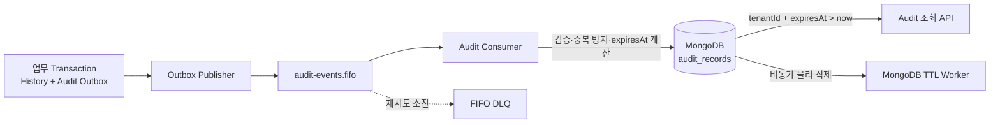

# 감사 데이터 보존 및 보안 설계

> 프로젝트: SaaS 기반 POS·Kiosk 주문·결제 및 대기열 관리 서비스
>
> 문서 상태: MVP 인프라 구현 기준선
>
> 기준일: 2026-08-10
>
> 현재 구현 상태: MongoDB 적재·중복 방지·TTL Index 코드는 일부 존재하지만, AWS 자원·백업·관측·재처리 인프라는 아직 구현되지 않았다.

## 1. 문서의 목적과 범위

이 문서는 기존의 Audit Retention, Database 접근 보안, MVP 이후 외부 증적 문서를 하나로 통합한 인프라 기준이다. 다음 질문에 답한다.

- 감사 기록과 업무 History·기술 Log는 어떻게 다른가?
- Audit Event는 어떻게 안전하게 전달·중복 제거되는가?
- `expiresAt`은 누가 계산하고 TTL은 어떻게 적용하는가?
- Runtime, Index 관리, Backup 권한은 어떻게 나누는가?
- Backup을 복구했을 때 이미 만료된 기록은 어떻게 처리하는가?
- S3 Object Lock 같은 외부 불변 증적은 언제 도입하는가?

전체 AWS 배포·셀 격리·IngressGroup은 [AWS EKS 셀 기반 인프라 설계](AWS_EKS_셀_기반_인프라_설계.md)를 따른다. Application 기능과 Event 정본은 다음 문서다.

- [09 Audit·History·Logging 기능 명세](<../../Docs/Specifications/09 Audit·History·Logging/기능 명세.md>)
- [Audit Service 컨텍스트](<../../Docs/Specifications/MSA/05 Audit Service.md>)
- [비동기 Event 계약](../../Docs/Specifications/비동기_Event_계약.md)

## 2. 핵심 결정

| 항목 | MVP 기준 |
|---|---|
| 중앙 감사 저장소 | Cell별 MongoDB `audit.audit_records` |
| 기본 보존 기간 | 환경 설정, 초기값 90일 |
| 만료 시각 | Audit Consumer가 수신 시 적용 중인 정책으로 `occurredAt + retentionDays` 계산 |
| 논리 만료 | 모든 조회에 `expiresAt > now` 필수 |
| 물리 삭제 | MongoDB `expiresAt` TTL Index의 비동기 삭제 |
| 중복 방지 | Unique `(source.service, source.eventId)` |
| Event 전달 | Cell별 `audit-events.fifo` + FIFO DLQ, At-least-once |
| 업무 History | 각 서비스 PostgreSQL이 소유, Audit TTL 제외 |
| 기술 Log | CloudWatch 등 Log Backend의 별도 보존 정책 |
| 외부 불변 증적 | MVP 제외, 규제·계약 조건 발생 시 별도 ADR로 도입 |

90일은 법적 요구를 확정한 값이 아니다. 운영 전에 개인정보·계약·법적 요구를 검토하고 승인된 값을 환경 설정과 Runbook에 남긴다.

## 3. 데이터 경계

### 3.1 중앙 Audit와 Domain History

Audit Service는 업무 서비스의 중요 행위를 조회하기 위한 Snapshot을 MongoDB에 저장한다. 주문·결제·대기열의 정본이 아니며, 업무 상태를 복구하기 위해 Audit MongoDB를 역방향으로 쓰지 않는다.

| 데이터 | 소유 저장소 | 목적 | Audit TTL 영향 |
|---|---|---|---|
| Domain Aggregate | 서비스별 PostgreSQL | 현재 업무 상태 | 없음 |
| Domain History | 서비스별 PostgreSQL | 상태 전이·정산 근거 | 없음 |
| Audit Record | Audit MongoDB | 주요 행위 조회·안전 조사 | 있음 |
| Application Log | Log Backend | 장애 분석·관측 | 별도 정책 |

### 3.2 셀 격리

- Alpha Audit는 Alpha `audit-events.fifo`만 소비하고 Alpha MongoDB만 사용한다.
- Bravo Audit는 Bravo Queue와 MongoDB를 전용으로 사용한다.
- Event에 `cellId`를 넣어 분기하지 않고, Queue URL·Pod Identity·Network로 셀을 확정한다.
- 각 Record의 `tenantId`는 셀 내 Tenant 조회 격리에 사용한다.

## 4. 생성부터 만료까지

1. 업무 서비스가 업무 상태·History·Audit Outbox를 PostgreSQL Local Transaction으로 Commit한다.
2. Outbox Publisher가 자기 셀의 `audit-events.fifo`에 `AuditRecorded` Event를 전달한다.
3. Audit Consumer가 Version·Source·Tenant·Actor·Action·Metadata 계약을 검증한다.
4. Consumer가 수신 시 적용 중인 `retentionDays`로 `expiresAt = occurredAt + retentionDays`를 한 번 계산한다.
5. `(source.service, source.eventId)` Unique 제약으로 중복 저장을 제거한다.
6. 새 Record 저장 또는 중복 확인 후에만 SQS Message를 ACK한다.
7. 조회 API는 MongoDB의 물리 삭제 여부와 무관하게 `expiresAt > now`를 적용한다.
8. TTL Worker가 만료 Record를 최종 삭제한다.

TTL Worker가 정확한 만료 시각에 즉시 삭제한다고 가정하지 않는다. Event가 느리게 도착했다는 이유로 `receivedAt`부터 90일을 다시 부여하지 않는다.

## 5. MongoDB Index와 권한

### 5.1 필수 Index

| Index | 옵션 | 목적 |
|---|---|---|
| `source.service + source.eventId` | Unique | SQS 재전달·중복 소비 제거 |
| `tenantId + occurredAt` | 정렬 방향 명시 | Tenant 기간 조회 |
| `tenantId + action + occurredAt` | 정렬 방향 명시 | Action 필터 |
| `tenantId + target.type + target.id + occurredAt` | 정렬 방향 명시 | 대상 기준 조회 |
| `expiresAt` | TTL `expireAfterSeconds=0` | 만료 Record 물리 삭제 |

Index Bootstrap은 재실행 가능해야 하며 이름만 아니라 Key 순서·Unique·TTL 옵션을 검증한다. 잘못된 운영 Index를 Application 기동 중 임의로 삭제·재생성하지 않는다.

### 5.2 MongoDB 권한 분리

| 주체 | 허용 | 금지 |
|---|---|---|
| Audit Runtime | `audit_records` 삽입·승인된 조회 | User·Role 관리, 임의 Index 삭제, 다른 Database 접근 |
| Index Bootstrap | 승인된 Unique·조회·TTL Index 생성·검증 | Application Traffic 처리 |
| Backup·Restore | 승인된 Backup·격리 복구 | 평상시 Application Query |

Runtime, Index Bootstrap, Backup Credential을 각각 다른 Secret 경로와 신원으로 관리한다.

## 6. Event·Queue 보안

### 6.1 Producer와 Consumer 신뢰

Event Body의 `sourceService`·`tenantId`를 문자열로 넣었다는 사실만으로 신뢰하지 않는다.

- Queue Policy는 Store Access·Commerce·Payment·Queue의 자기 셀 Pod Identity만 `SendMessage`를 허용한다.
- Audit Pod는 자기 셀 `audit-events.fifo`의 Receive·Delete·Visibility 변경만 허용받는다.
- Application Validator는 `sourceService`, `eventType`, `version`, Actor Type, Action과 Target 조합을 Allowlist로 검증한다.
- `MessageGroupId`·`MessageDeduplicationId`는 비동기 Event 계약의 `AuditRecorded` 공식을 사용한다.
- DLQ 조회·재처리 권한은 Application Runtime이 아닌 제한된 운영 주체가 가진다.

SQS Consumer는 SendMessage를 수행한 IAM Principal을 Message Body에서 직접 알 수 없다. 따라서 Queue Policy·Pod Identity·전용 Queue·Application 계약 검증을 하나의 신뢰 경계로 사용한다.

### 6.2 민감정보 제한

Audit Event와 Log에 다음 값을 넣지 않는다.

- Password·Hash·원문 인증정보
- Session·Cookie·Token·Kiosk Secret
- Toss Secret·전체 `paymentKey`·카드·계좌 원문
- 원문 `Idempotency-Key`
- 전화번호·주소 등 불필요한 개인정보
- 전체 HTTP Request·Response Body

`metadata`는 `(sourceService, action)`별 Allowlist Field만 사용한다. Key 이름만 검사하지 않고 값에 포함된 Token·개인정보·결제 식별자도 검증한다.

## 7. 서비스별 접근 경계

### 7.1 Database·Cache

| 서비스 | Runtime 저장소 | Migration·Bootstrap | 금지 접근 |
|---|---|---|---|
| Store Access | `store_access_db`, Redis Session | Store Access Flyway Role | 다른 PostgreSQL DB, MongoDB |
| Commerce | `commerce_db` | Commerce Flyway Role | 다른 PostgreSQL DB, Redis, MongoDB |
| Payment | `payment_db` | Payment Flyway Role | 다른 PostgreSQL DB, Redis, MongoDB |
| Queue | `queue_db` | Queue Flyway Role | 다른 PostgreSQL DB, Redis, MongoDB |
| Audit | MongoDB `audit.audit_records` | Audit Index Bootstrap | PostgreSQL 4 DB, Redis |

- PostgreSQL Runtime Role은 자기 Database의 승인된 DML·Sequence만 사용한다.
- Flyway Migration Role에만 DDL을 허용하고 제한된 배포 Job에 주입한다.
- Runtime Role의 `DROP`, `TRUNCATE`, Role 변경·권한 위임을 차단한다.
- 한 서비스의 복구를 위해 다른 서비스 Database를 같은 시점으로 Rollback하지 않는다.

### 7.2 Queue IAM

| Workload | Send | Consume |
|---|---|---|
| Store Access | `audit-events.fifo` | 없음 |
| Commerce | `queue-events.fifo`, `audit-events.fifo` | `commerce-events.fifo` |
| Payment | `commerce-events.fifo`, `audit-events.fifo` | 없음 |
| Queue | `audit-events.fifo` | `queue-events.fifo` |
| Audit | 없음 | `audit-events.fifo` |

위 이름은 논리 Queue다. 실제 ARN은 환경·셀이 포함된 물리 Queue를 지정한다.

### 7.3 Secret·TLS·Credential 회전

- 서비스별 Pod Identity는 자기 Database·Queue·Provider Secret 경로만 읽는다.
- Migration·Index Bootstrap Secret은 Runtime Secret과 다른 경로에 둔다.
- PostgreSQL·MongoDB 운영 연결은 TLS와 Server Identity를 검증한다.
- CA 교체 전 Trust Bundle·Readiness·Rollback을 사전 검증한다.
- Credential 회전은 신규 발급→Secret Version 갱신→Pod Rollout→신규 Connection 확인→기존 Connection Drain→구 Credential 폐기 순서다.
- Secret Store 값이 바뀐것만으로 실행 중 Process와 Connection Pool이 자동 전환된다고 가정하지 않는다.

## 8. Backup과 복구

Live MongoDB의 TTL 삭제는 이미 생성된 Backup·Snapshot에서 Document를 즉시 삭제하지 않는다. Backup 보존을 Live Retention과 별도로 정의하지 않으면 만료 기록을 우회 보존하는 결과가 생길 수 있다.

### 8.1 복구 순서

1. 외부 쓰기·조회 Traffic을 차단한 격리 환경에 복구한다.
2. 복구 시점과 적용할 Retention 정책 Version을 확정한다.
3. Unique·조회·TTL Index의 Key·Option을 검증한다.
4. 복구 시점 기준 이미 만료된 Record를 조회에서 제외한다.
5. Outbox·Inbox·SQS 보존 범위와 복구 시점 이후 Event를 대조한다.
6. Consumer를 제한적으로 재개하고 중복 없이 상태가 수렴하는지 확인한다.
7. Tenant Scope·논리 만료·조회 권한 Smoke Test 후 Traffic을 연다.

복구 환경은 만료 기록의 일반 조회 수단이 아니다. 접근자를 제한하고 작업 후 승인된 절차로 폐기한다.

## 9. 관측과 운영

| 영역 | 최소 신호 |
|---|---|
| Consumer | 성공·실패·중복, 처리 지연, 마지막 성공 시각 |
| SQS | Main Queue 지연, 가시 Message, 최고 체류 시간, DLQ 수 |
| MongoDB | 연결·쓰기·조회 지연, 용량, 필수 Index |
| Retention | 논리 만료 조회 제외, TTL 삭제 지연 이상 징후 |
| Backup | 마지막 성공 시각, 복구 훈련 결과, RPO·RTO |
| Security | 다른 Cell·Database·Queue·Secret 접근 거부, 인증 오류 |

Publisher 실패인 Outbox `FAILED`와 Consumer 실패인 SQS DLQ를 서로 다른 경보로 관리한다. DLQ Message를 삭제하기 전에 원인·영향 Cell·재처리 결과를 운영 기록에 남긴다.

## 10. MVP 완료 조건

- Testcontainers MongoDB에서 Unique·조회·TTL Index의 Key·Option을 검증한다.
- `occurredAt`·`retentionDays`로 계산된 `expiresAt`과 정책 변경 후 비소급을 검증한다.
- TTL의 비동기 특성을 고려해 논리 만료와 물리 삭제를 분리해 Test한다.
- Tenant·기간·Role·`expiresAt > now`를 적용한 목록·단건 조회를 검증한다.
- 잘못된 Source·Version·Action·Metadata·Tenant가 저장되지 않는지 검증한다.
- 동일 Event 재전달이 하나의 Record로 수렴하고 ACK되는지 검증한다.
- MongoDB 장애 시 재시도·DLQ, 복구 후 재처리를 검증한다.
- 다른 Database·Cell Queue·Secret 접근이 실패하는 거부 Test를 둔다.
- Runtime·Migration·Index Bootstrap·Backup Identity 분리를 IAM·Credential 증거로 남긴다.
- Domain History와 마감 Snapshot이 Audit TTL로 삭제되지 않는지 확인한다.
- 격리된 Backup 복구에서 만료 제외·Index·Event 수렴·Traffic 재개를 재현한다.
- Secret·개인정보·전체 Event Payload가 Git·Image·Plan·Log·Metric에 노출되지 않는다.

## 11. MVP 이후 외부 불변 증적

다음 구성은 현재 WBS와 MVP 완료 조건에 포함하지 않는다.

- S3 Object Lock Compliance Mode 기반 삭제 증적
- Retention Evidence 전용 Outbox·Publisher
- Sealed Manifest·Hash Chain·Merkle Root
- Legal Hold·관리자 2인 승인 Workflow
- 장기 보존 전용 KMS Key·검증 Job

### 11.1 도입 조건

다음 중 하나가 확정되면 별도 ADR·위협 모델·비용 검토 후 도입한다.

- 규제나 계약이 Database 외부의 변경 불가능한 증적을 요구한다.
- MongoDB·CloudTrail·Backup 증적이 내부 통제를 충족하지 못한다.
- 삭제 전 전체 Audit 무결성 검증 결과를 장기 보존해야 한다.

도입 전에 보존 대상·기간·Legal Hold·삭제 권한·Region·암호화·예상 Event 양·비용·RPO·RTO·감사자 조회 방식을 승인한다.

### 11.2 후속 설계 원칙

1. 증적 Writer는 Audit Runtime과 다른 Pod Identity를 사용한다.
2. Object Lock Bucket은 Versioning·Retention Mode·KMS 수명을 하나의 정책으로 검증한다.
3. 동일 Object Key 재기록과 조기 삭제를 IAM·Bucket Policy·조건부 쓰기로 차단한다.
4. 원 업무 Payload를 복제하지 않고 Event ID·정책 Version·삭제·검증 결과만 최소한으로 저장한다.
5. 증적 실패가 원 업무·중앙 Audit를 Rollback하는 분산 Transaction을 만들지 않는다.
6. `audit-events.fifo` Consumer와 경쟁 소비하지 않고 독립 목적지·재시도·중복 방지 계약을 사용한다.

## 12. 아직 결정할 항목

- MongoDB 관리형 제품·Private 연결·Backup 방식
- 운영 Retention·Backup 보존 기간과 정책 승인자
- RPO·RTO·복구 훈련 주기
- DLQ Redrive 도구·승인·폐기 절차
- TTL 지연·Consumer Lag·DLQ·Backup 실패 경보 임계값
- 서비스 신원과 `sourceService`를 강게 결합할 Event 서명 또는 검증 방식

이 항목은 미정이지만 각 모듈의 Application Port·Fake·Event Fixture를 사용한 독립 개발을 막지 않는다. 실제 AWS 통합과 운영 완료를 보고하기 전에는 반드시 확정하고 검증한다.
